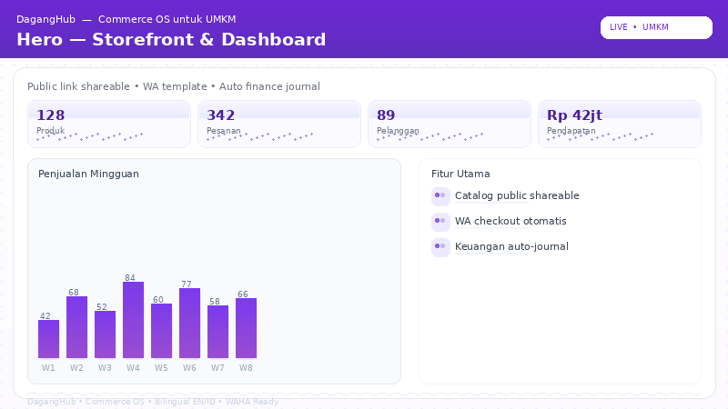
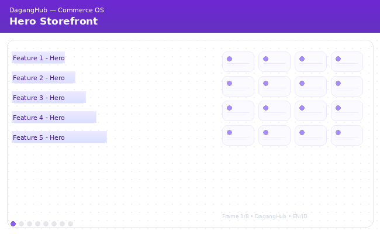
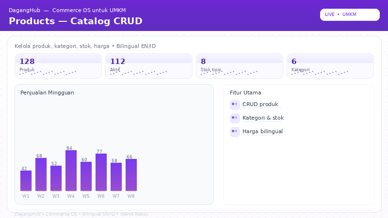
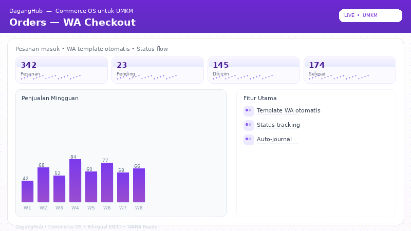
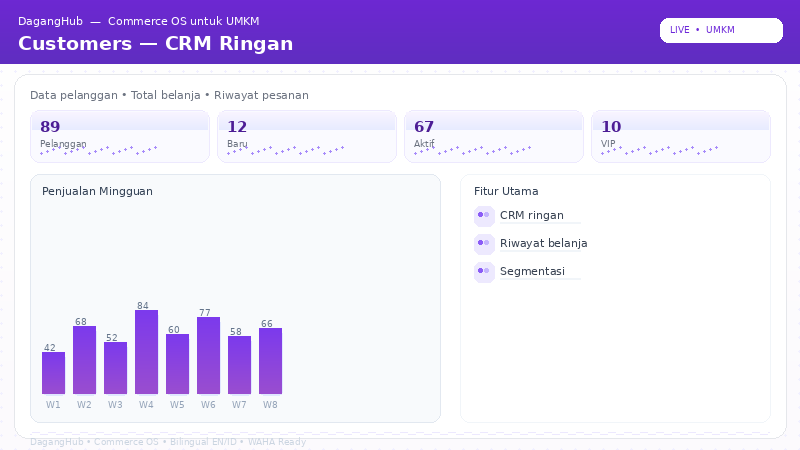
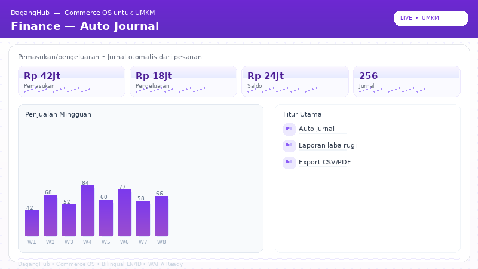
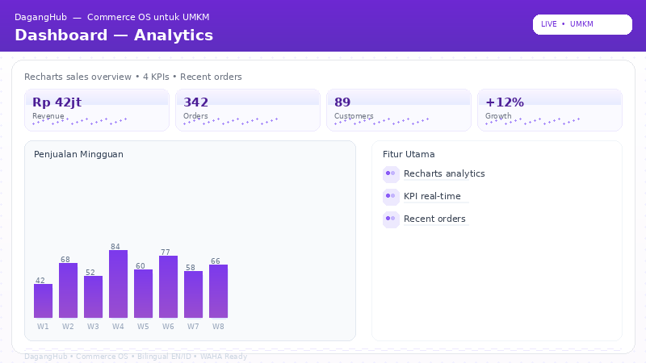

# DagangHub — Commerce OS for UMKM

[](https://nextjs.org/)
[](https://tailwindcss.com/)
[](https://www.typescriptlang.org/)
[](https://opensource.org/licenses/MIT)
[](https://github.com/Zwart04/daganghub)

Complete Commerce OS for Indonesian UMKM — public storefront shareable, WhatsApp checkout with template automation, auto finance journal, and Meta/Google Ads tracking in one lightweight dashboard.

**Live Demo:** https://daganghub.zwart.my.id · **Repository:** https://github.com/Zwart04/daganghub





**View Full Demo Video:** [public/screenshots/page.webm](public/screenshots/page.webm) · Also available as [docs/demo.gif](docs/demo.gif)

---

## Features

### 1. Public Storefront — Shareable Link
Shareable public catalog at `/store/[slug]` with bilingual catalog, product cards, and direct checkout. Copy link, preview, and enable/disable public mode.


### 2. Products — Catalog CRUD
Full product management with categories, stock, pricing, active toggle, bilingual names, and Recharts inventory overview.



### 3. Orders — WhatsApp Checkout Flow
Create orders, auto-generate WhatsApp template message with product/qty/total, send via WAHA-ready integration, and track status pending → delivered. Each order auto-creates a finance journal entry.



### 4. Customers — Lightweight CRM
Customer database with phone, email, address, total orders and spent, search/filter, and order history linkage.



### 5. Finance — Auto Journal
Income/expense journal auto-generated from orders, manual adjustments, balance overview, and category breakdown with Recharts. Export to CSV.



### 6. Dashboard — Analytics
Recharts sales overview, 4 KPI cards (Revenue, Orders, Customers, Growth), recent orders table, and weekly bar chart with per-bar vertical gradient.



### 7. WhatsApp Integration — WAHA Ready
Configure WAHA URL (`NEXT_PUBLIC_WAHA_URL`), scan QR, session status, send test template, and auto template for checkout. Works with `devlikeapro/waha` via `docker run -p 3000:3000 devlikeapro/waha`.

### 8. Ads Tracking — Meta Pixel & Google Ads
Injects `fbq('init')` and `gtag('config')` when `NEXT_PUBLIC_META_PIXEL_ID` / `NEXT_PUBLIC_GOOGLE_ADS_ID` is set. Tracks ViewContent, Purchase, and Lead conversions from storefront and checkout.

---

## Tech Stack

| Layer | Technology |
|-------|------------|
| Framework | Next.js 14 App Router (React 19) |
| Styling | Tailwind CSS v4 + CSS variables (OKLCH) |
| Icons | lucide-react |
| Charts | Recharts |
| Auth | localStorage hf_user / hf_users (professional mock) |
| I18n | Custom EN/ID dictionary (full bilingual) |
| Integrations | WAHA (devlikeapro/waha), Meta Pixel fbq, Google gtag |
| Storage | In-memory DB with localStorage persistence |
| Deployment | Vercel + Cloudflare DNS (zwart.my.id) |

## Getting Started

### Prerequisites
- Node.js 20+
- npm 10+

### Installation
```bash
git clone https://github.com/Zwart04/daganghub.git
cd daganghub
npm install
npm run dev
```
Open http://localhost:3000 — you will see the professional login page.

### Build
```bash
npm run build
npm start
```

### Environment Variables
```bash
NEXT_PUBLIC_WAHA_URL=http://localhost:3000
NEXT_PUBLIC_META_PIXEL_ID=your_pixel_id
NEXT_PUBLIC_GOOGLE_ADS_ID=AW-XXXXXXXXX
```

## Project Structure
```
src/
  app/
    page.tsx                # hf_user auth + tab router (bilingual)
    layout.tsx              # Pixel/gtag injection + providers
    globals.css             # Tailwind v4 + hsl(var) theme
    (dashboard)/
      dashboard/page.tsx
      products/page.tsx
      orders/page.tsx
      customers/page.tsx
      finance/page.tsx
      storefront/page.tsx
      waha/page.tsx
      settings/page.tsx
    storefront/[slug]/page.tsx  # public shareable link
    api/
  components/
    DashboardLayout.tsx
    DashboardSidebar.tsx
    TopBar.tsx
  contexts/
    DataContext.tsx
    I18nContext.tsx
  lib/
    db.ts
    i18n.ts
    waha.ts
  types/
docs/
  hero.png
  dashboard.png
  products.png
  orders.png
  customers.png
  finance.png
  demo.gif
public/screenshots/
  page.webm                 # 1280x720 VP9 demo video
```

## Demo Account

| Role | Email | Password |
|------|-------|----------|
| Admin | admin@rosari.id | password123 |

Login at `/` — the root page handles auth via `hf_user` in localStorage. No external OAuth required. To reset, clear localStorage `hf_user` and `hf_users`.

Bilingual toggle: ID / EN button in login and header — all titles use `t.*` dictionary.

## Roadmap

- Supabase/Postgres persistence for products/orders/customers
- Real WAHA QR streaming (WebSocket) and broadcast templates
- Midtrans/Xendit payment gateway + invoice PDF export
- Inventory barcode scanning and low-stock alerts
- PWA for offline storefront
- Multi-store support and role-based staff access

## License

MIT — free for UMKM and commercial use.

## Acknowledgments

Built for zwart.my.id daily factory — Commerce OS variant for Indonesian UMKM.
